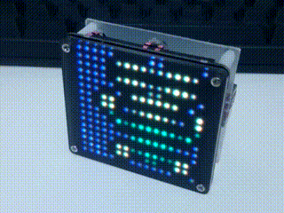
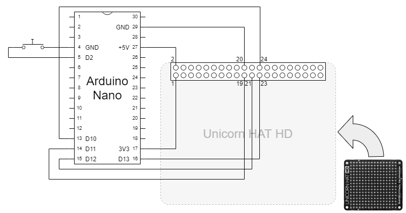

# Arduino X2PAV (Hexadeca-Squared Pixel Art Viewer)

## Description

16×16-dotted pixel art viewer with **Arduino Nano** and **Unicorn HAT HD**.



You can switch the animation by pressing button.
The screen is turned off automatically after idling for 30 seconds, and it resumes by pressing button.

## Hardware

### Materials

* [Arduino Nano](https://store.arduino.cc/usa/arduino-nano) (or compatible product)
* [Unicorn HAT HD](https://shop.pimoroni.com/products/unicorn-hat-hd)
* A tact switch
* Wires, connectors, etc...

### Circuit diagram



## Software 

### Build and transfer

Clone the source code and open the project file "ArduinoX2PAV.ino" with Arduino IDE.

You can build the source code with following configuration.

* Board: "Arduino Nano"
* Processor: "ATmega328P (Old Bootloader)"

Then, you can transfer binary data to Arduino Nano by usual way.

### Append new scenario

You can design new scenario using [Arduino X2PAV Scenario Editor](https://obono.github.io/ArduinoX2PAV/index.html).

This tool outputs a header file as scenario data.

To append the scenario you designed, edit "ArduinoX2PAV.ino".

* Include the header file.
* Add `SEQUENCE_DATA` macro to the `sequences[]` array.

```
 #include "data/sample1.h"
 #include "data/sample2.h"
 #include "data/sample3.h"
+#include "data/foo.h"

     (ellipsis)

 PROGMEM static const SEQUENCE_T sequences[] = {
     SEQUENCE_DATA(sample1),
     SEQUENCE_DATA(sample2),
     SEQUENCE_DATA(sample3),
+    SEQUENCE_DATA(foo),
     NULL
 };
```

### License

These codes are licensed under [MIT-License](LICENSE).
